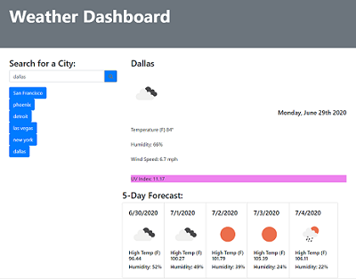
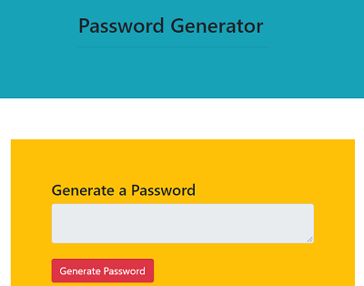
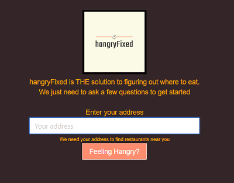

# updated-portfolio
The goal of this project was to update our professional portfolio with our recently completed project and two other assignments. Also, we were to include updates to Github portfolio, resume, and LinkedIn.

### Prerequisites

* Visual Studio Code https://code.visualstudio.com/
* Bootstrap https://getbootstrap.com/
* Linkedin https://linkedin.com/
* Medium https://medium.com/

### Execution

* Updated Bio and headshot image
```
 
                </div>
                <div class="col-md-8 text-wrap">
                    <p>After completing his military service in 2007, Joe began working in corporate customer serivce
                        and sales roles. It was there where he developed a love for helping clients. During the Covid-19
                        pandemic, Joe developed a new passion for coding. He attended the UC Berkeley Extension Bootcamp
                        and became a Full Stack Developer.</p>    
```            
* Updated portfolio page
```
<H3 class="text-center"><a href="https://github.com/jdavis3333" target="_blank">Check out some of Joe's
                work!</a></H3>
        <div class="row col-12">
            <div class="col-4">
                
                <p class="text-center"><a href="https://jdavis3333.github.io/weather-dashboard/">Weather Dashboard</a>
                </p>
            </div>
            <div class="col-4">
                
                <p class="text-center"><a href="https://jdavis3333.github.io/Password-Generator/">Password-Generator</a>
                </p>
            </div>
            <div class="col-4">
                
                <p class="text-center"><a href="https://idelmundo.github.io/hangryfixed/">hangryFixed</a></p>
            </div>
        </div>
```
* Updated Contact page
```
 <h4>Feel free to reach out and check out Joe's social media!</h4>
            <ul>
                <li><a href="https://www.linkedin.com/in/joe-davis-a8380232/" target="_blank">Linkedin</a></li>
                <li><a href="https://github.com/jdavis3333" target="_blank">GitHub</a></li>
                <li><a href="https://medium.com/@jdavis3333" target="_blank">Blog</a></li>
                <li><a href="Joe_Davis_resume_2020.c.pdf" target="_blank">Resume</a></li>
                <li><a href="mailto:jdavis3333@gmail.com">Email Joe!</a></li>
                <li>Phone Number: 760-267-3318</li>
            </ul>
```

## Built With

* [HTML](https://developer.mozilla.org/en-US/docs/Web/HTML)
* [CSS](https://developer.mozilla.org/en-US/docs/Web/CSS)
* [Javascript](https://developer.mozilla.org/en-US/docs/Web/JavaScript)

## Deployed Link

* https://jdavis3333.github.io/updated-portfolio/


## Authors

* Joe Davis

- [Link to Github](https://github.com/)
- [Link to LinkedIn](https://www.linkedin.com/)


## License

This project is licensed under the MIT License 